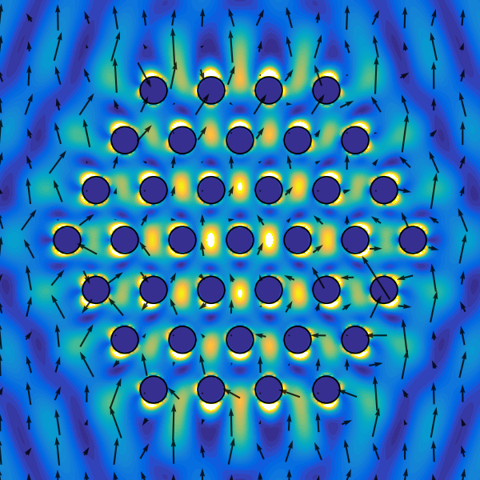

MiePy
==============
MiePy is a Python module for the generalized multiparticle Mie theory (GMMT), also known as the aggregate T-matrix method.
MiePy solves the electrodynamics of a collection of spherical or non-spherical scatterers with an arbitrary incident source.

<p align="center">
  
  <br>
  <em>Electric field around a 37 particle cluster</em>
</p>

<p align="center">
  
  <br>
  <em>3D electric field contours around three metal nanoparticles</em>
</p>

Features
--------------
+ **Non-spherical particles** using the T-matrix formulation via the null-field method with discrete sources (NFM-DS). Includes cylinders, spheroids, ellipsoids, cubes and polygonal prisms
+ **Arbitrary incident sources** (plane waves, Gaussian beams, HG and LG beams, point dipoles)
+ Evaluation of cluster **cross-sections** and **optical force and torque** on individual particles
+ **Periodic boundary conditions** with various lattice types (square, hexagonal, etc.) and **mirror and discrete rotational symmetries** for faster calculations
+ Optional **planar interface (substrate)** 
+ **3D scene visualization** using the VPython library
+ Image clusters using a **simulated microscope**
+ **OpenMP parallelization** for systems with larger numbers of particles

Installation
--------------
```shell
pip install miepy
```

If using `uv`:
```
uv venv --python 3.13
uv pip install miepy
source .venv/bin/activate
```

Usage
--------------

For examples and use cases, see [examples](./examples) folder.

For an overview of the theory, see [docs](./docs) folder.

Install from source
--------------
MiePy uses [vcpkg](https://vcpkg.io/) for C++ dependency management and uv for Python management, which simplifies building across platforms.

**Prerequisites:**
+ GCC and GFORTRAN
+ uv

**Build steps:**

1. Clone MiePy and its submodules:
```shell
git clone https://github.com/johnaparker/miepy.git miepy --recurse-submodules && cd miepy
```

2. Bootstrap vcpkg (first time only):
```shell
./vcpkg/bootstrap-vcpkg.sh
```

3. Install MiePy using uv:
```shell
uv sync
```

4. Optionally, run the tests to verify correctness:
```shell
uv run pytest tests
```

License
--------------
MiePy is licensed under the terms of the GPLv3 license.
